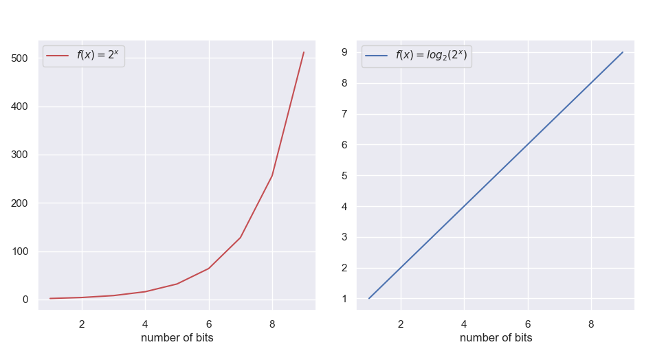
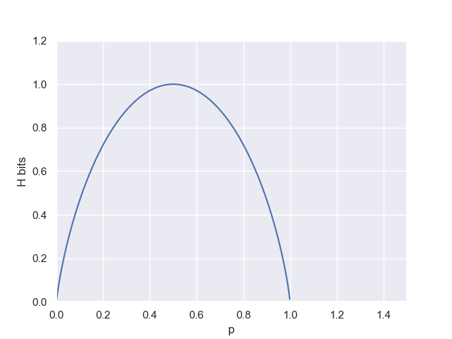

## **Information Entropy**

For me, entropy has being always an elusive term to grab. Yes, no matter which field, I have being told that it's a measurement of disorder. Great. But how shannon entropy represents information disorder? What does it even mean information disorder? why this specific formula? and who invited the logarithms to this party? After checking several sources, I wasn't very convince by any explanations. Until I went to the original source: Shannon paper published in 1948, _"A Mathematical Theory of Communication"_

So let's start by dissecting the equation:

### Shannon unit of information
First of all we should note about the term ****. It might seems weird to have a logarithm of a probability and indeed it is but remember, Shannon was a genius so there must be something behind it. Let me just give you the dogmatic answer: the term represents **conveniently** quantity of information.
Not satisfy? Do you want proves and reasons? You are not a good believer. But hold on, I will convert you to the Shannon church. 

Imagine that you had a communication system where the number of messages would be finite and each option would be equally likely to be chosen. This number can be regarded as a measurement of the amount of information transmitted every time a message is sent. 

GRAFICA con 3 mensajes. Equally likely. 

Every time that a message is sent, 3 units of information are transferred. Now what happen if the probabilities were not equal?

GRAFICA con 3 mensajes unbalanceados. 

The first message, 'yes', is sent half percent of the times or in other words, 1 out of 2 times. On the other hand, 'no' and 'maybe' are sent one fourth of the times. Following with the already defined measurement, the first message generate 2 units of information while the latter two 4. The messages with lower probability encode more information, because they are removing more uncertainty. Let's say that we had a machine that tells you every 5 minutes if the sun has exploded or not. A negative answer is what you expect, does not contain much information. The opposite will blow you mind, it will tell you muuuuuch more(for at least 8 minutes).

Good, now we can measure quantity of information based on probabilities. The magic comes with logarithms. In practice we can apply any monotonic function to _N_, and will still be a valid measurement as will maintain the same hierarchy i.e. . But look at this. Let's plug directly the probabilities in the logarithms, instead of the clumsy ratio.

With the logarithms we can use the directly the probabilities, and maintain the the hierarchy in the information scale. Congratulations, you are an initiated in Shannon church. This is the so called, shannon unit of information

The advantages of using logarithms is not merely being able to use probabilities. The logarithmic is nearer to the intuitive feeling as a measurement. In general, the number of possibile states of a system tend to vary linearly with the logarithm of the parameters. For example, if we encode information using thebinary system every time we add a new bit we are doubling the possible messages we can send. The number of possible messages grows exponentially. **maybe here using a more interesting exmple**

### Tie everything together

Having a measure of quantity of information for a single message the only thing left is to measure the amount of information produced by the whole system. For example, imagine a weather station which is producing every day a prediction. Imagine that the only possible scenarios are _sun_, _rain_, _snow_, and _cloudy_. And now imainge that the weather station is in Malaga. The probabilities for each case will look like 

GRAFICA 

I wonder if it has ever snow in Malaga. Actually I have just googled it. There is an article talking about _"that time when it snowed in Malaga in 1954"_. So yes, I guess 0,1 percent is actually too much. For each scenario the radio station tansmits different amount of information: 

As expected the _Snow_ case is much more informative for the Malaga citizens while _Sunny_ is their everyday bread and butter. But how much information does the station transmits on average? That is the entropy.

1,136 bits of information are produced on average. That is what the entropy means if we put in words _"amount of transsmited information of the system on average"_. Now you may wonder, is it Malaga radio station a entropic system? If you did so, that would be weird. But let's keep that example, let's move to Copenhaguen. I bet that weather is station is busy. There is a saying in Denmark, _"don't leave home without your swimming suit, your coat and your umbrella"_. I might have just invented that, but, yeah, the weather is definetly entropic. Let's assume the following.

Skipping the boring calucaltions the entropy amounts to **1,98 bits of information**. That is almost double. You see the amount of information for each scenario is almost the same. This an entropic system. It's a unpredictable system. It's chaotic. Let's see one more example. Consider the entropy in the case of two possibilities with  and 

Here the advantages of this metric are even more prominent. First of all the highiest peak occurs at . This is naturally the case of highiest disorder, where nothing is more predictable than anything else. It then intutively correct to associate with the moment of maximum entropy.

Similarly, another great property is the lowest entropy points at  or . This is the extreme, where the outcome is predictable with no room for doubt. Then, again, it makes sense that the entropy is zero.

### Summing up

Entropy is just a measure of information. A very good one indeed, and we can understand it as an average of information provided by 
need to be finish

use http://worrydream.com/Tangle/ for ilustrations